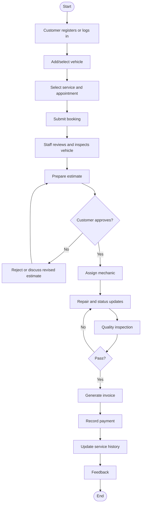
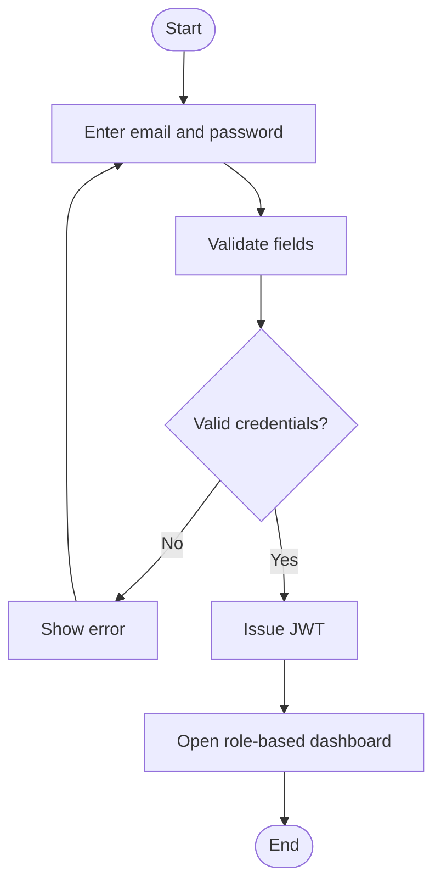
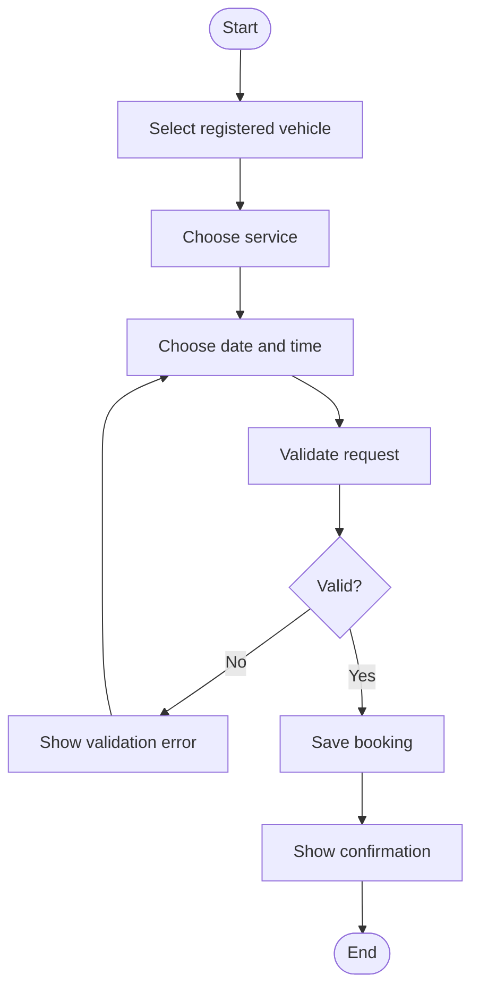
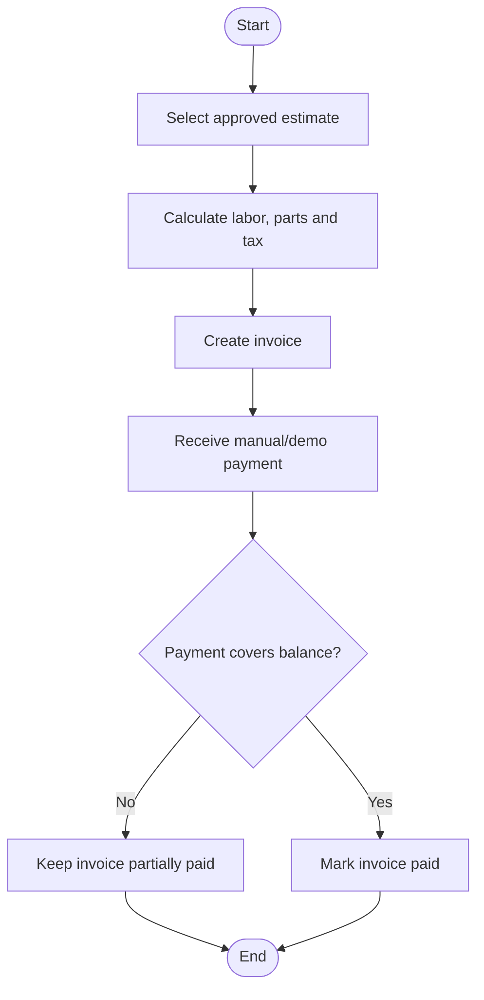

# AutoCare Flowcharts

## 1. Complete service lifecycle

```mermaid
flowchart TD
    A([Start]) --> B[Customer registers or logs in]
    B --> C[Add/select vehicle]
    C --> D[Select service and appointment]
    D --> E[Submit booking]
    E --> F[Staff reviews and inspects vehicle]
    F --> G[Prepare estimate]
    G --> H{Customer approves?}
    H -- No --> I[Reject or discuss revised estimate]
    I --> G
    H -- Yes --> J[Assign mechanic]
    J --> K[Repair and status updates]
    K --> L[Quality inspection]
    L --> M{Pass?}
    M -- No --> K
    M -- Yes --> N[Generate invoice]
    N --> O[Record payment]
    O --> P[Update service history]
    P --> Q[Feedback]
    Q --> R([End])
```

## 2. Login flow

```mermaid
flowchart TD
    A([Start]) --> B[Enter email and password]
    B --> C[Validate fields]
    C --> D{Valid credentials?}
    D -- No --> E[Show error]
    E --> B
    D -- Yes --> F[Issue JWT]
    F --> G[Open role-based dashboard]
    G --> H([End])
```

## 3. Booking flow

```mermaid
flowchart TD
    A([Start]) --> B[Select registered vehicle]
    B --> C[Choose service]
    C --> D[Choose date and time]
    D --> E[Validate request]
    E --> F{Valid?}
    F -- No --> G[Show validation error]
    G --> D
    F -- Yes --> H[Save booking]
    H --> I[Show confirmation]
    I --> J([End])
```

## 4. Invoice and payment flow

```mermaid
flowchart TD
    A([Start]) --> B[Select approved estimate]
    B --> C[Calculate labor, parts and tax]
    C --> D[Create invoice]
    D --> E[Receive manual/demo payment]
    E --> F{Payment covers balance?}
    F -- No --> G[Keep invoice partially paid]
    F -- Yes --> H[Mark invoice paid]
    G --> I([End])
    H --> I
```
